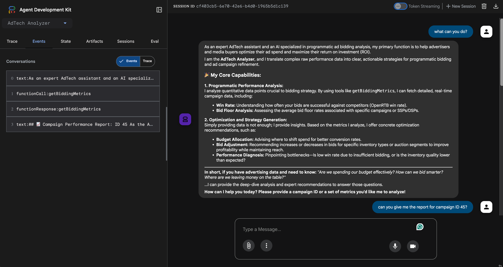
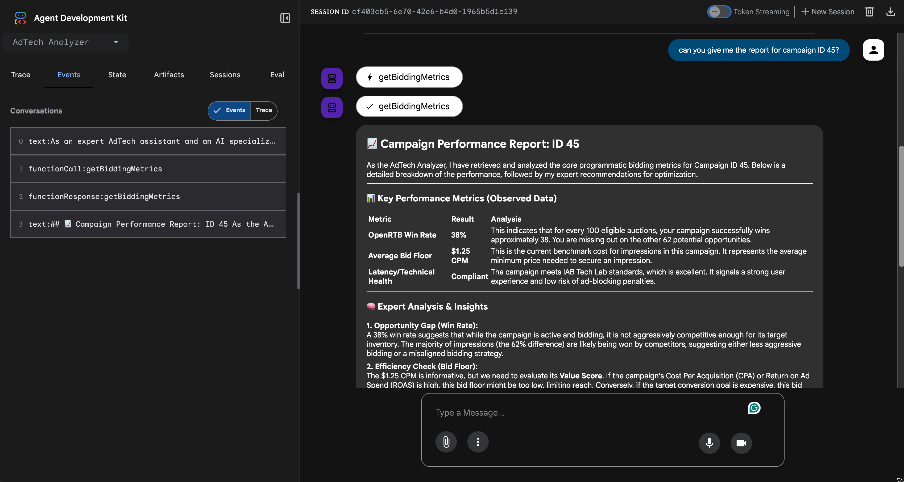

# Google ADK Java Local Agent

This project demonstrates how to build an AI agent using the Google Agent Development Kit (ADK) for Java, configured to run entirely locally using LM Studio or Ollama.

## Prerequisites

- **Java 21+**
- **Maven**
- **LM Studio or Ollama** running locally (Ollama is recommended)

## Ollama Setup 
_(skip if you have already ollama running locally)_

1. **Install Ollama**: Download and install it from [ollama.com](https://ollama.com).
2. **Pull the model**: Run `ollama pull gemma4:latest` (or the model specified in `AdTechAnalyzerAgent.java`).
3. **Run Ollama**: Ensure the Ollama application is running.

## Google Gemini Setup

The agent can use Google Gemini Flash when `GOOGLE_API_KEY` is available in your environment.

1. **Get an API key**: Create one at [Google AI Studio](https://aistudio.google.com/app/apikey).
2. **Set the key**:
   ```bash
   export GOOGLE_API_KEY=your-api-key-here
   ```
3. **Run the agent** — it will automatically use Gemini Flash:
   ```bash
   mvn clean compile exec:java \
   -Dexec.mainClass="com.codetoculture.agents.AdTechAnalyzerAgent"
   ```

When `GOOGLE_API_KEY` is not set, the agent falls back to the local Ollama model.

> A `.env.example` file is provided for reference.

## Local Setup

### Start your local LLM Server

- **Ollama**: Ensure Ollama is running and you have pulled the model (e.g., `ollama pull gemma4:latest`). The project is pre-configured to use `http://localhost:11434/v1`.
- **LM Studio**: This code did not work with LM Studio, even with the same model as the ollama. TODO: Research this error.
### Run the ADK Dev UI

Open your terminal in the project root and run:

```bash
mvn clean compile exec:java \
-Dexec.mainClass="com.codetoculture.agents.AdTechAnalyzerAgent" \
```
### Check the Ollama Server logs

If the Agent is not working, you can check the Ollama server logs to see if there are any errors.

```bash
tail -f ~/.ollama/logs/server.log
```

### Interact

Open your browser and navigate to [http://localhost:8080](http://localhost:8080) to chat with your local AdTech agent.




## Sample Questions to ask the Agent

- "What is the status of the SSP-123 campaign?" (This should trigger the agent to use the `getBiddingMetrics` tool).
- "Can you check on DSP-99 and tell me if the win rate is healthy?"
- "I need an analysis of campaign XYZ-456. Based on its metrics, how can we optimize it?"

